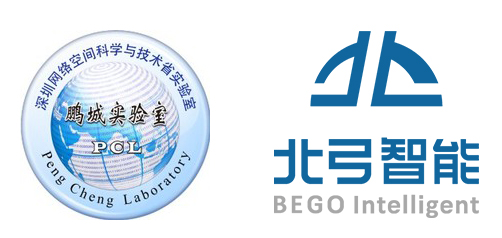
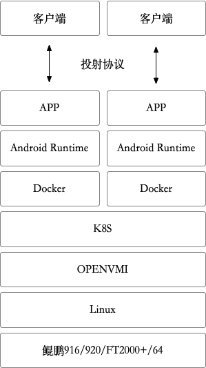

# OPENVMI

### 联合开发单位：
鹏城实验室[(PCL)](https://dw.pcl.ac.cn/#/home/index)  
江苏北弓智能科技有限公司[(Begoit)](http://www.begoit.com/)

## 概述
基于ARM+Linux体系构建的VMI（Virtual Mobile Infrastructure）云平台
## 架构

### 硬件支持
* 鲲鹏916  
* 鲲鹏920  
* FT2000+/64（仅支持64位APP运行）
### 支持的系统版本
* Ubuntu 18.04
* Ubuntu 20.04
## 安装
详见[安装说明](docs/install.md)
## 使用
详见[使用说明](docs/云手机使用指导.md)
## 问题反馈
如果您在使用过程中有疑问，请联系zhoujun@begoit.com
## 许可协议
采用GPLv3协议
## 感谢
感谢[anbox](https://github.com/anbox/anbox)、[robox](https://github.com/lag-linaro/robox)项目组做的开创性工作  
感谢鹏城实验室[开发者云平台](https://dw.pcl.ac.cn/#/developer/cloud)提供的帮助  
感谢华为在[鲲鹏社区](https://bbs.huaweicloud.com/forum/forumdisplay-fid-931-orderby-lastpost-filter-typeid-typeid-829.html)发布的相关[优化措施](https://code.opensource.huaweicloud.com/Kunpeng/Native/home)
## 免费适配
### 免费申请云手机，开展适配测试工作  
注册登陆：https://dw.pcl.ac.cn/#/developer/cloud  
选择”虚拟机“-”云手机软件栈“，申请后根据邮件提示开始适配测试工作
