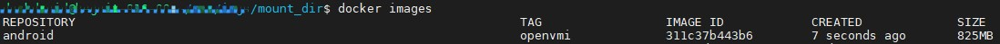

# 编译Android镜像
对于openvmi，我们使用的是最低限度的Android定制版本，但除此之外，我们的所有工作都基于最新版本的[Android Open Source Project](https://source.android.com/)

要重建Android映像，您需要首先获取所有相关资源。这将占用您大量的磁盘空间（约40GB）。AOSP建议至少有100GB的可用磁盘空间。

通常，对于构建openvmi Andorid镜像，适用[AOSP项目说明](https://source.android.com/source/requirements.html)。在这里，我们将不再描述一般如何构建Android系统，而仅着重于openvmi所需的步骤。

## 安装 Repo
Repo 是一款工具，可让您在 Android 环境中更轻松地使用 Git。

要安装 Repo，请执行以下操作：

1. 确保主目录下有一个 bin/ 目录，并且该目录包含在路径中：

```bash
$ mkdir ~/bin
$ PATH=~/bin:$PATH
```
2. 下载 Repo 工具，并确保它可执行：

```bash
$ curl https://storage.googleapis.com/git-repo-downloads/repo > ~/bin/repo
$ chmod a+x ~/bin/repo
```

## 获取所有相关资源
首先在编译服务器中创建一个新的目录，您还将在其中下载Android系统源码。

```bash
$ mkdir $HOME/openvmi-work
```
现在，通过下载清单来初始化存储库并开始获取源代码：

```bash
$ cd $HOME/openvmi-work
$ repo init -u https://github.com/DockDroid/platform_manifests.git -b openvmi
$ repo sync -j16
```
这将花费一些时间，具体取决于您的Internet连接速度（**另外，下载前需要为编译服务器配置VPS/VPN代理服务**）。

## 编译Android系统源码
成功下载所有源代码后，您可以开始编译Android系统。

首先，在Android源码目录中创建一个新的目录vendor：

```bash
$ mkdir vendor
```
将[openvmi](https://github.com/DockDroid/openvmi)复制进该目录中。

其次，使用envsetup.sh脚本初始化环境：

```bash
$ source build/envsetup.sh
```
然后使用初始化构建lunch：

```bash
$ lunch openvmi_arm64-userdebug
```

支持的构建目标的完整列表：
- openvmi_armv7a_neon-userdebug
- openvmi_armv7a_neon-user
- openvmi_arm64-userdebug
- openvmi_arm64-user

现在开始编译Android系统：
```bash
# 直接执行make可能会报错，推荐先执行: export LC_ALL=C
$ export LC_ALL=C
$ make -j32
```

## 制作Android文件系统镜像
系统编译完成后，我们需要使用编译出的system.img和ramdisk.img来构建openvmi所需的Android文件系统镜像。

```bash
$ cd $HOME/openvmi-work/vendor/openvmi
$ scripts/create-package.sh \
    $PWD/../out/target/product/arm64/ramdisk.img \
    $PWD/../out/target/product/arm64/system.img
```
这将在当前目录中创建一个android.img文件。

这样，您现在可以在openvmi运行时使用该镜像。

## 在集群各节点服务器上导入安卓系统Docker镜像
1. 将制作好的android.img文件传输至节点服务器上，并创建新目录：

```bash
$ mkdir mount_dir
```
2. 将android镜像挂载到mount_dir目录:

```bash
$ sudo mount android.img ./mount_dir
```
3. 进入mount_dir目录，制作Docker镜像：

```bash
$ cd ./mount_dir
$ sudo tar --numeric-owner -cf- . | docker import - android:openvmi
```
4. 查看系统容器，确认android:openvmi镜像存在：

```bash
$ docker images
```

